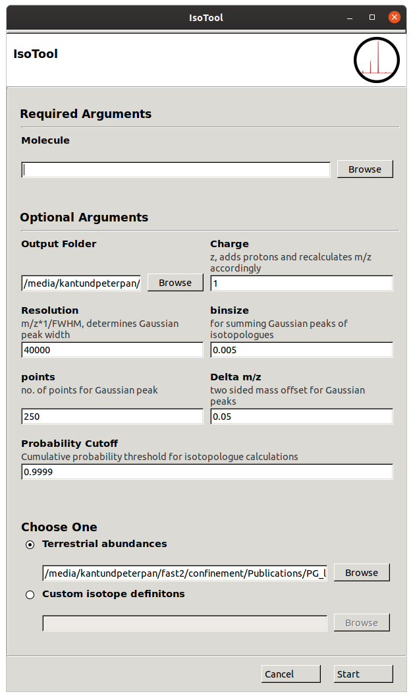

# IsoTool 
Isotopologue and mass spectrum calculator

## Installation
### Dependencies
all dependencies are available via pip
- numpy
- pandas
- scipy
- IsoSpecPy
- gooey

### Linux
pip wheel TBD

conda TBD

For the time being Linux users need to clone the rep and install dependencies manually.

### Windows
Windows users can either clone the repository or use a Release which comes bundled with Winpython
containing all necessary packages. Unzip and launch via `isotool_win.bat`.

## Usage
### Isotope definitions
#### Terrestrial
IsoTool comes with a .csv-file containing the terrestrial abundances of known elements 
(`data/isotopes_terrestrial.csv`), retrieved from the [National Institute of Standards
and Technology](https://physics.nist.gov/cgi-bin/Compositions/stand_alone.pl).

#### Custom Isotope definitions
It is possible to define custom isotopes, e.g. for isotopoic labeling experiments. The
definitions have to be stored in a csv-file similar to the terrestrial isotope definitions.

```csv
element_symbol,mass_number,atomic_mass,abundance,
C,12,12.0000000000000,0.01
C,13,13.0033548350723,0.99
X,..,................,....
```
These files can easily be edited in any spreadsheet or text editor.

### Molecule
The Molecule file contains the elemental composition of the chemical species of interest.
```
element,n
C,54
X,20
..,..
```
**Elements appearing in the molecule file need to have their isotopes defined in the
Isotope file used for the calculations.**

### GUI

Default parameters are taken from Ref. 1.

### Output
All outputs are in `csv` format, that can be edited in any spreadsheet or text editor.

#### Centroids
The `centroids.csv` file contains a table with m/z, p and the exact isotopic composition of each
of the calculated isotopologues.

#### Spectrum
The `spectrum.csv`file contains the profile spectrum of the given chemical species after modeling 
and summing Gaussian peaks for the calculated isotopolgues

## Methodology
The exact methodology and an example application are described in [1] . The underlying algorithm for
the fast calculation of isotopologue probabilities (*IsoSpec*) has been described by *Łącki et al.*[2], while the
workflow for Gaussian peak simulation has been heavily inspired by functionality available in
mineXpert [3]. 

## Implementation
IsoTool is written in Python 3 and makes use of the *numpy* [4], *pandas*[5] and *scipy*[6] libraries as well as the Python bindings for *IsoSpec*[7]. The GUI was created using the *gooey* package [7].

## References
[1] Atze, Rusconi, Arthur ....

[2] IsoSpec: Hyperfast Fine Structure Calculator Mateusz K. Łącki, Michał Startek, Dirk Valkenborg, and Anna Gambin Analytical Chemistry 2017 89 (6), 3272-3277 DOI: 10.1021/acs.analchem.6b01459

[3] mineXpert: Biological Mass Spectrometry Data Visualization and Mining with Full JavaScript Ability, Filippo Rusconi, Journal of Proteome Research 2019 18 (5), 2254-2259, DOI: 10.1021/acs.jproteome.9b00099

[4] Stéfan van der Walt, S. Chris Colbert and Gaël Varoquaux. The NumPy Array: A Structure for Efficient Numerical Computation, Computing in Science & Engineering, 13, 22-30 (2011), DOI:10.1109/MCSE.2011.37 

[5] Wes McKinney. Data Structures for Statistical Computing in Python, Proceedings of the 9th Python in Science Conference, 51-56 (2010) 

[6] Virtanen, P., Gommers, R., Oliphant, T.E. et al. SciPy 1.0: fundamental algorithms for scientific computing in Python. Nat Methods 17, 261–272 (2020). https://doi.org/10.1038/s41592-019-0686-2

[7] https://github.com/chriskiehl/Gooey
